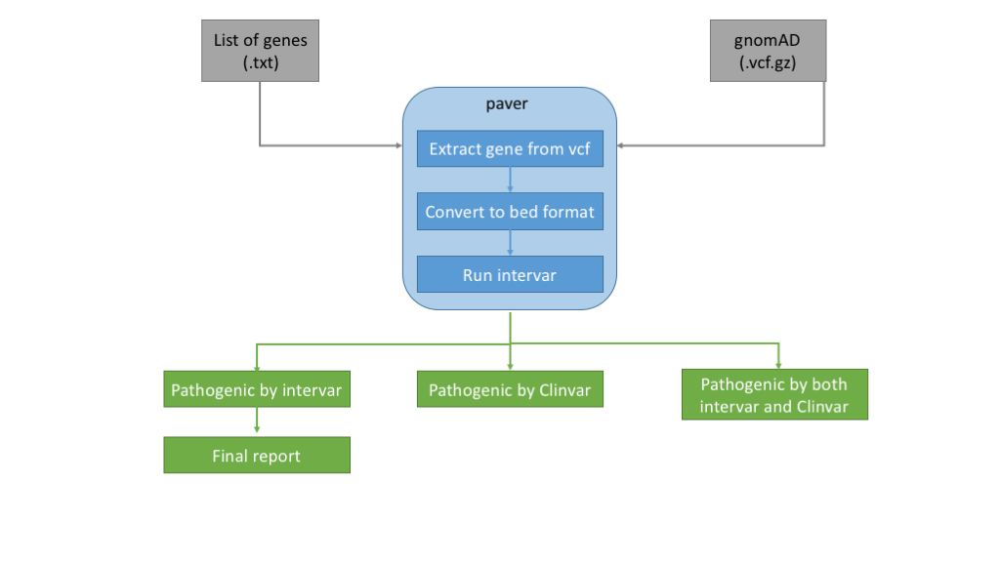

# Pathogenic Variant Reporter (PAVAR)

PAVAR classifies pathogenic rare variants based on the guideline of ACMG/AMP and estimate the affected number of persons  in the U.S. population, based on Hardy-Weinberg equilibrium (HWE).

The program is written by python and R.

- Prerequisite:
  - [InterVar](https://github.com/WGLab/InterVar)
  - R library dependencies: the hwe.R script automatically installs the packages if not found.
    - [HardyWeinberg](https://cran.r-project.org/web/packages/HardyWeinberg/index.html)
    - [optparse](https://cran.r-project.org/web/packages/optparse/index.html)
    - [data.table](https://cran.r-project.org/web/packages/data.table/)

- Now you are ready to run the [paver.py](https://github.com/dauss75/pavar/blob/master/bin/paver.py) script.

./bin/paver.py --inputF input/chr3genes.txt --ref gnomad/gnomad.exomes.r2.0.2.sites.vcf.bgz --out_dir output/gnomad/wes/chr3
