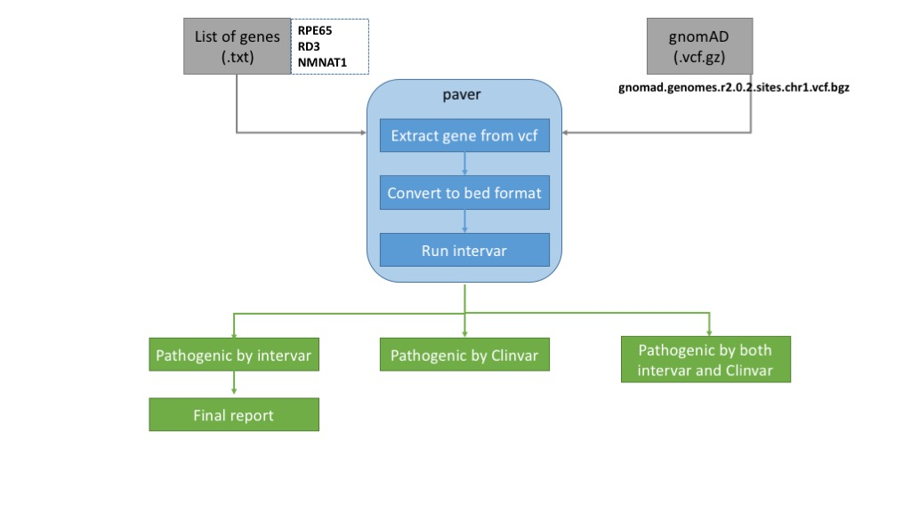

# Pathogenic Variant Reporter (PAVAR)

PAVAR classifies rare pathogenic variants based on the guideline of ACMG/AMP 2015 and estimate the affected number of individuals in the U.S. population (326,766,748 as of June 2018), based on the Hardy-Weinberg equilibrium (HWE).

## Screenshot of Workflow



The workflow takes in two input files, a text file containing a gene list and a vcf file from gnomad (i.e., wgs, wes). Then, for each gene the program extracts data from the gnomad vcf file followed by converting it to a bed file format.
The bed file is fed into intervar and the output is parsed to generate three files. The pathogenic variants classified by intervar are used to estimate further the affected individuals using HWE.

- Install the prerequisite:
  - [InterVar](https://github.com/WGLab/InterVar) - install under the paver directory
  - R library dependencies: the hwe.R script automatically installs the packages if not found.
    - [HardyWeinberg](https://cran.r-project.org/web/packages/HardyWeinberg/index.html)
    - [optparse](https://cran.r-project.org/web/packages/optparse/index.html)
    - [data.table](https://cran.r-project.org/web/packages/data.table/)

- Now you are ready to run the [paver.py](https://github.com/dauss75/pavar/blob/master/bin/paver.py) script.

Example

```
./bin/paver.py --inputF input/chr1genes.txt --ref gnomad/gnomad.genomes.r2.0.2.sites.chr1.vcf.bgz --out_dir output/gnomad/wgs/chr1
```
